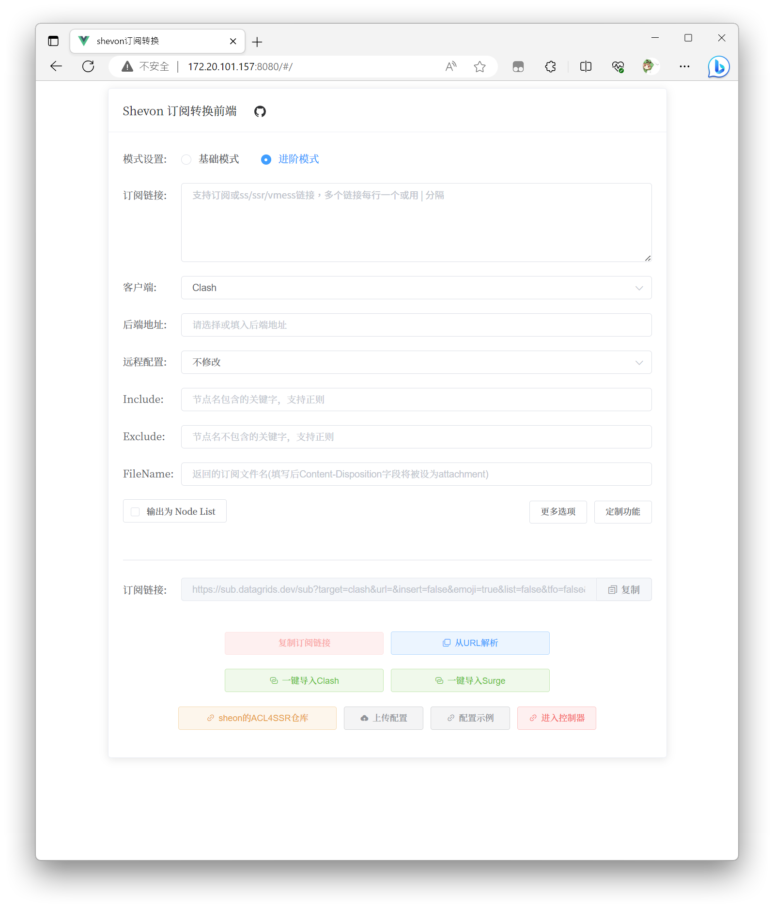
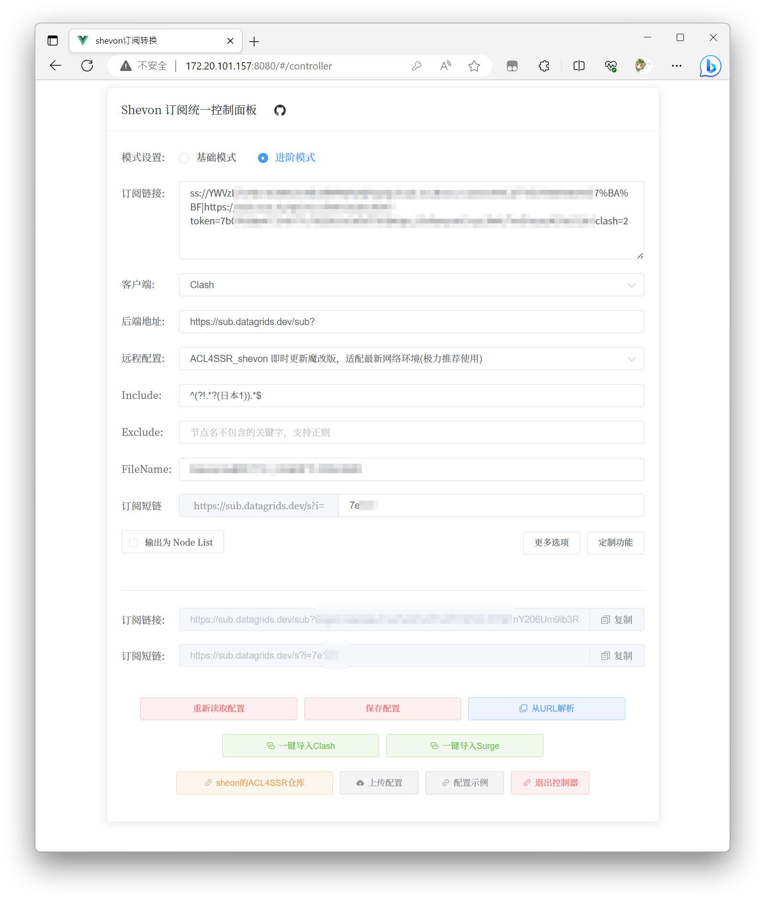

# sub-web

前端fork自[CareyWang/sub-web](https://github.com/CareyWang/sub-web)，为该项目添加go后端以对接[tindy2013/subconverter](https://github.com/tindy2013/subconverter)并对单一订阅链接进行统一控制。

## Introduction

### 前端部分

相比于原始项目，本项目的改动如下：
- 更改路由为hash路由，以优化前后端交互；
- 远程配置添加shevon维护的acl4ssr规则；
- 订阅链接与form表单通过watch绑定，不再需要点击生成订阅链接来实现；
- 优化前端界面展示
- 新增订阅统一控制器，可对单一订阅链接进行统一控制（详细见下）


### 控制面板和后端部分

控制面板使用jwt鉴权，目前仅支持单用户单配置文件，后端采用gin框架。登录后将会通过index页面的controller路由进入控制面板，在控制面板中填写的订阅配置信息在点击保存配置后会在后端生成一个配置文件，借此方法保存订阅链接。并且可以自定义一个订阅短链，该短链将会被后端绑定到配置文件上，无论配置订阅如何改变，该短链均指向该订阅文件，从而实现多个设备使用一个链接订阅却可以实现更新其包含的节点和订阅信息而不需更改订阅链接的目的。非常适合经常更换机场而不想在多个设备上重新设置订阅的用户。



## ChangeLog


## Requirements

### 前端调试

你需要安装 [Node](https://nodejs.org/zh-cn/) 与 [Yarn](https://legacy.yarnpkg.com/en/docs/install) 来安装依赖与打包发布。你可以通过以下命令查看是否安装成功。
注：以下步骤为 Ubuntu 下相应命令，其他系统请自行修改。为了方便后来人解决问题，有问题请发 issue。

```shell
node -v
v16.20.0

yarn -v
1.22.19
```

```shell
make frontend
```

浏览器访问 <http://localhost:8080/>

### 前后端交互调试

第一次
```shell
make go
make run
```
以后只需要使用`make run`调试

### 编译上线

```shell
make build
```

## Deploy

启动编译后的sub-web二进制程序。默认监听8080端口。

```shell

以下为nginx配置文件`/sub`路径反代25500端口上的subconverter后端，`/`根路径反代8080上的go后端。该go后端已嵌入本项目sub-web魔改版前端。

```shell
server {
        listen       443 ssl http2;
        server_name  sub.datagrids.dev;
        ssl_certificate "/etc/nginx/cert/fullchain.pem";
        ssl_certificate_key "/etc/nginx/cert/privkey.pem";

        error_page 404 /404.html;
            location = /40x.html {
        }

        error_page 500 502 503 504 /50x.html;
            location = /50x.html {
        }
        
        location ~ ^/(version|sub) {
                    add_header Access-Control-Allow-Origin $http_origin;
                    add_header Access-Control-Allow-Headers *;
                    add_header Access-Control-Allow-Methods *;
                    proxy_redirect     off;
                    proxy_set_header   Host             $host:$server_port;
                    proxy_set_header   X-Real-IP        $remote_addr;
                    proxy_set_header   X-Forwarded-For  $proxy_add_x_forwarded_for;
                    proxy_next_upstream error timeout invalid_header http_500 http_502 http_503 http_504;
                    proxy_max_temp_file_size 0;
                    proxy_connect_timeout      90;
                    proxy_send_timeout         90;
                    proxy_read_timeout         90;
                    proxy_pass http://127.0.0.1:25500;
                }

        location / {
                    add_header Access-Control-Allow-Origin $http_origin;
                    add_header Access-Control-Allow-Headers *;
                    add_header Access-Control-Allow-Methods *;
                    proxy_redirect     off;
                    proxy_set_header   Host             $host:$server_port;
                    proxy_set_header   X-Real-IP        $remote_addr;
                    proxy_set_header   X-Forwarded-For  $proxy_add_x_forwarded_for;
                    proxy_next_upstream error timeout invalid_header http_500 http_502 http_503 http_504;
                    proxy_max_temp_file_size 0;
                    proxy_connect_timeout      90;
                    proxy_send_timeout         90;
                    proxy_read_timeout         90;
                    proxy_pass http://127.0.0.1:8080;
                }
    }
```
登录hash校对在`jwt.go`的`Login`函数中，每次登录都会打印hash结果，可以将该结果替换以实现更改账号密码。短链和后端地址修改在vue路由view的`Subcontroller.vue`中。

## Related

- [ShevonKuan/ACL4SSR](https://github.com/ShevonKuan/ACL4SSR/)
- [tindy2013/subconverter](https://github.com/tindy2013/subconverter)
- [CareyWang/MyUrls](https://github.com/CareyWang/MyUrls)
- [CareyWang/sub-web](https://github.com/CareyWang/sub-web)

## Contributing

PRs accepted.

Small note: If editing the README, please conform to the [standard-readme](https://github.com/RichardLitt/standard-readme) specification.

## License

MIT © 2020 CareyWang
MIT © 2023 ShevonKuan
